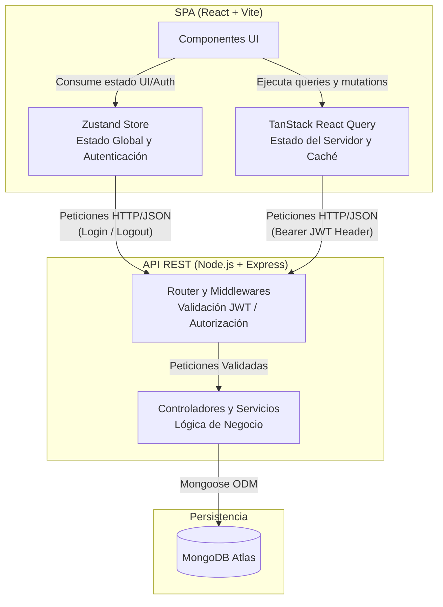

# Arquitectura del Sistema (Modelo C4 - Nivel 2: Contenedores)

Este diagrama describe los contenedores principales de la aplicación, sus responsabilidades y los protocolos de comunicación utilizados.

> [!NOTE]
> **Nota de Diseño:** Zustand gestiona exclusivamente el estado cliente/sesión local, mientras que TanStack React Query abstrae la sincronización, reintentos y almacenamiento en caché de los datos provenientes de la API REST.
