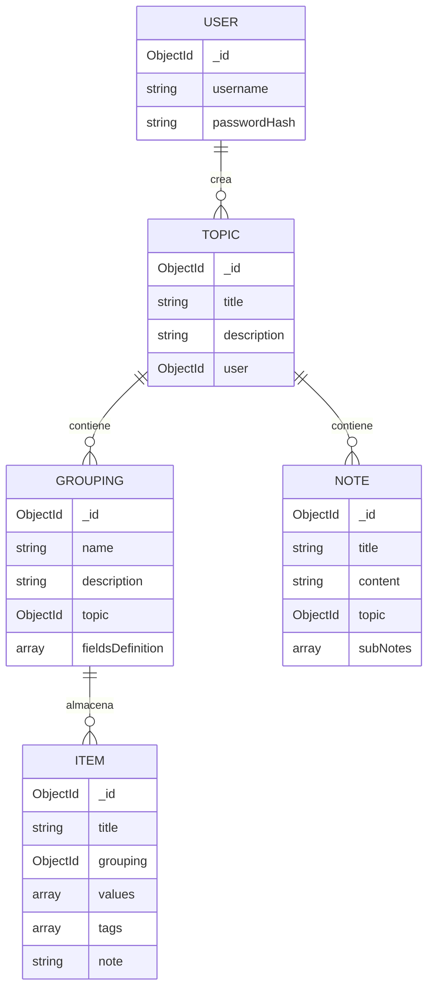

```mermaid
erDiagram
    USER ||--o{ TOPIC : "crea"
    TOPIC ||--o{ GROUPING : "contiene"
    TOPIC ||--o{ NOTE : "contiene"
    GROUPING ||--o{ ITEM : "almacena"

    USER {
        ObjectId _id
        string username
        string passwordHash
    }

    TOPIC {
        ObjectId _id
        string title
        string description
        ObjectId user
    }

    GROUPING {
        ObjectId _id
        string name
        string description
        ObjectId topic
        array fieldsDefinition
    }

    ITEM {
        ObjectId _id
        string title
        ObjectId grouping
        array values
        array tags
        string note
    }

    NOTE {
        ObjectId _id
        string title
        string content
        ObjectId topic
        array subNotes
    }
```
