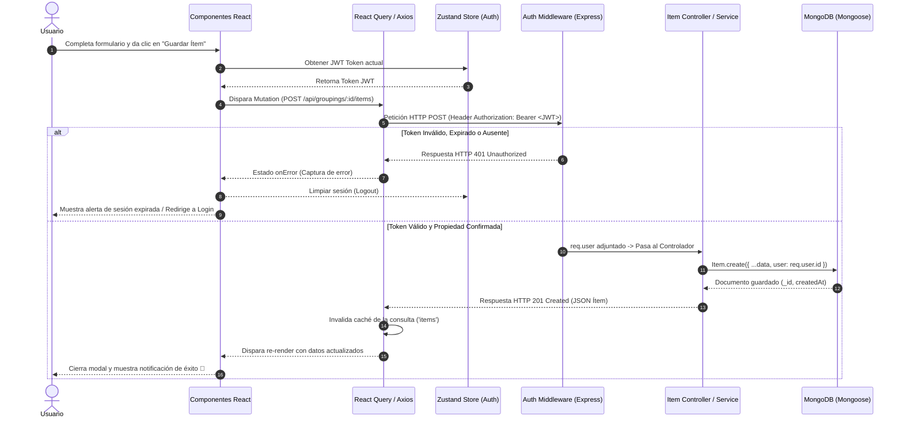

# Diagrama de Secuencia: Creación de Ítem con Autenticación JWT

Este diagrama ilustra el ciclo de vida completo de una petición de escritura (POST) desde la acción del usuario en la SPA hasta la persistencia en la base de datos, destacando la interceptación del middleware de autenticación en Express.

