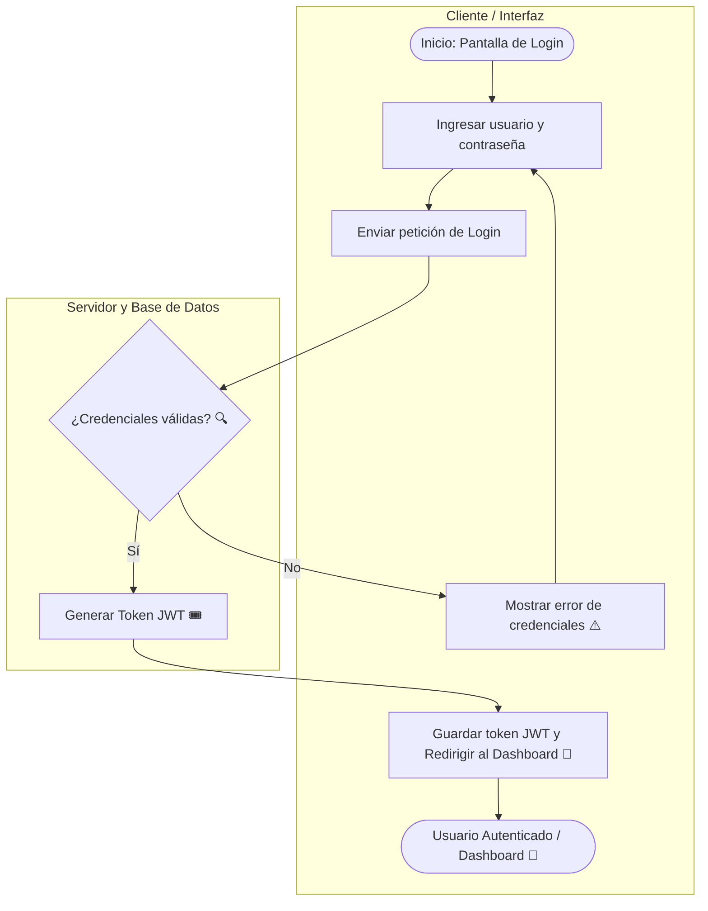
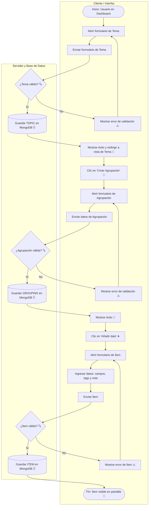
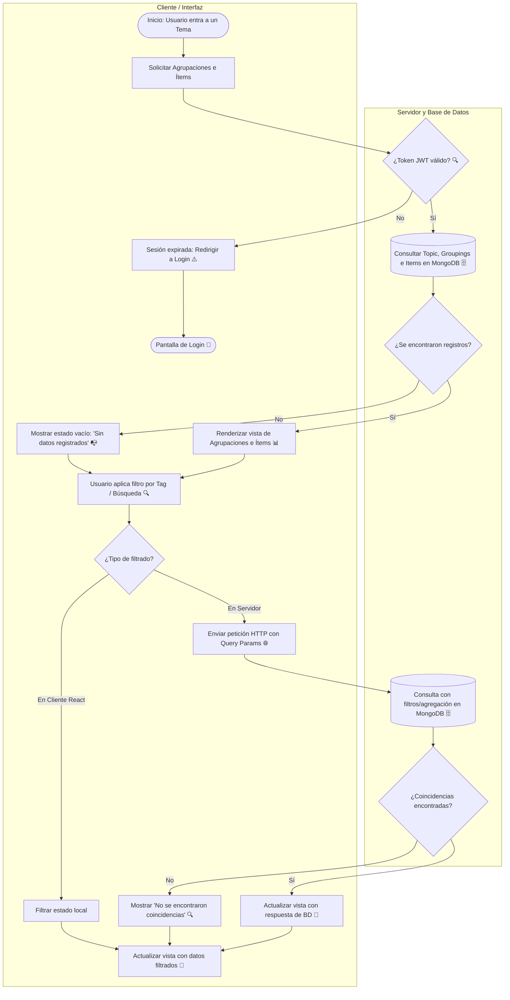
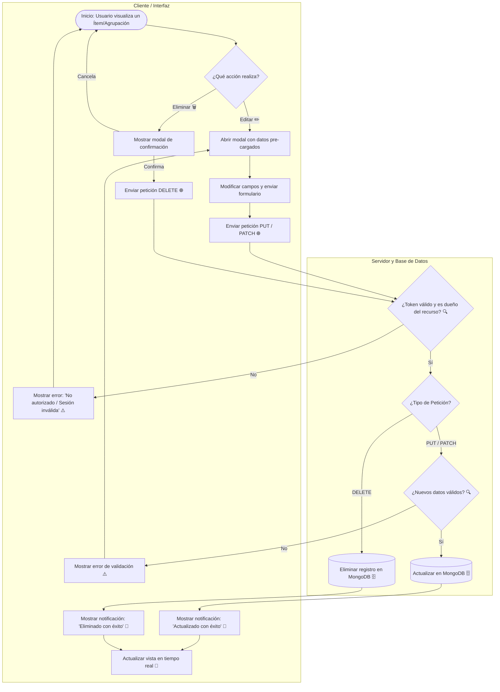

## 1. Flujo de Autenticación

## 2. Flujo de Creación (Topic ➔ Grouping ➔ Item)

## 3. Flujo de Consulta y Filtrado (CRUD Read)

## 4. Flujo de Edición y Eliminación (CRUD Update & Delete)

> [!NOTE]
> **Eliminación en Cascada:** El flujo de eliminación aplica por igual a **Temas**, **Agrupaciones** e **Ítems**. Al eliminar un Tema o una Agrupación, el backend ejecuta una eliminación en cascada en MongoDB para remover automáticamente todos los registros hijos asociados y evitar datos huérfanos.
